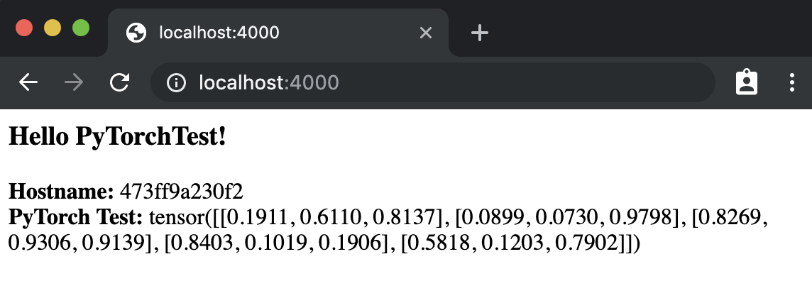

# Machine Vision
A test project, demonstrating how to use [Docker](https://www.docker.com/) and [PyTorch](https://pytorch.org/) to build a Generative Adversarial Network (GAN) model.

# Requirements

* [Docker](https://www.docker.com/)

# Getting Started
1. Clone this repository using

    ```git clone https://github.com/epip08/machine_vision.git```

2. Make sure Docker is installed and running.

3. From Command Prompt / Terminal, build the Docker image:

    ```docker build --tag=machine_vision .```

4. Run the Docker image in a container:

    ```docker run -p 4000:80 machine_vision```

5. Open a browser and navigate to [localhost:4000](http://localhost:4000)

Currently the app generates a small sample of data using PyTorch. This data is displayed with a welcome message and your current hostname. You should see something similar to:



# Articles:

* [GANs from Scratch 1: A deep introduction. With code in PyTorch and TensorFlow](https://medium.com/ai-society/gans-from-scratch-1-a-deep-introduction-with-code-in-pytorch-and-tensorflow-cb03cdcdba0f)
